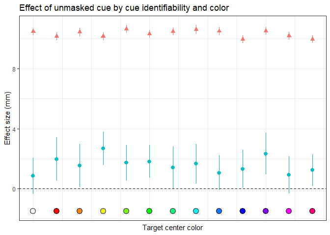

Meta-studies for robust tests of theory
================
Lennard Lukas Schmidt
2022-02-07

-   [Preparation](#preparation)
-   [Main analysis 1: Masked vs. unmasked
    cue](#main-analysis-1-masked-vs-unmasked-cue)
-   [Main analysis 2: Masked vs. unmasked cue moderated by cue
    identifiability](#main-analysis-2-masked-vs-unmasked-cue-moderated-by-cue-identifiability)
-   [Main analysis 3: Masked vs. unmasked cue moderated by cue
    identifiability and stimulus
    hue](#main-analysis-3-masked-vs-unmasked-cue-moderated-by-cue-identifiability-and-stimulus-hue)

This Notebook reproduces the analyses and figures from [Baribault et
al. (2017)](https://www.pnas.org/content/pnas/115/11/2607.full.pdf)
using R and Stan. The paper builds on the idea of radical randomization
(i.e., many independent experimental variables) using data from
subliminal priming experiments analyzed with hierarchical Bayesian
modeling.

# Preparation

## Loading packages

``` r
library(tidyverse)
library(cmdstanr)
library(tidybayes)
library(broom.mixed)
library(forcats)
library(rstan)
```

## Session

``` r
sessionInfo()
```

    ## R version 4.1.2 (2021-11-01)
    ## Platform: x86_64-w64-mingw32/x64 (64-bit)
    ## Running under: Windows 10 x64 (build 22000)
    ## 
    ## Matrix products: default
    ## 
    ## locale:
    ## [1] LC_COLLATE=English_Germany.1252  LC_CTYPE=English_Germany.1252   
    ## [3] LC_MONETARY=English_Germany.1252 LC_NUMERIC=C                    
    ## [5] LC_TIME=English_Germany.1252    
    ## 
    ## attached base packages:
    ## [1] stats     graphics  grDevices utils     datasets  methods   base     
    ## 
    ## other attached packages:
    ##  [1] rstan_2.21.2         StanHeaders_2.21.0-7 broom.mixed_0.2.7   
    ##  [4] tidybayes_3.0.1      cmdstanr_0.4.0       forcats_0.5.1       
    ##  [7] stringr_1.4.0        dplyr_1.0.7          purrr_0.3.4         
    ## [10] readr_2.0.2          tidyr_1.1.4          tibble_3.1.6        
    ## [13] ggplot2_3.3.5        tidyverse_1.3.1     
    ## 
    ## loaded via a namespace (and not attached):
    ##  [1] nlme_3.1-153         matrixStats_0.61.0   fs_1.5.0            
    ##  [4] lubridate_1.8.0      httr_1.4.2           tensorA_0.36.2      
    ##  [7] tools_4.1.2          backports_1.3.0      utf8_1.2.2          
    ## [10] R6_2.5.1             DBI_1.1.1            colorspace_2.0-2    
    ## [13] ggdist_3.0.0         withr_2.4.3          tidyselect_1.1.1    
    ## [16] gridExtra_2.3        prettyunits_1.1.1    processx_3.5.2      
    ## [19] curl_4.3.2           compiler_4.1.2       cli_3.1.0           
    ## [22] rvest_1.0.2          arrayhelpers_1.1-0   xml2_1.3.3          
    ## [25] posterior_1.1.0      scales_1.1.1         checkmate_2.0.0     
    ## [28] callr_3.7.0          digest_0.6.28        rmarkdown_2.11      
    ## [31] pkgconfig_2.0.3      htmltools_0.5.2      dbplyr_2.1.1        
    ## [34] fastmap_1.1.0        rlang_0.4.12         readxl_1.3.1        
    ## [37] rstudioapi_0.13      farver_2.1.0         generics_0.1.1      
    ## [40] svUnit_1.0.6         jsonlite_1.7.3       distributional_0.2.2
    ## [43] inline_0.3.19        magrittr_2.0.1       loo_2.4.1           
    ## [46] Rcpp_1.0.7           munsell_0.5.0        fansi_0.5.0         
    ## [49] abind_1.4-5          lifecycle_1.0.1      stringi_1.7.5       
    ## [52] yaml_2.2.1           pkgbuild_1.2.0       grid_4.1.2          
    ## [55] parallel_4.1.2       crayon_1.4.2         lattice_0.20-45     
    ## [58] haven_2.4.3          splines_4.1.2        hms_1.1.1           
    ## [61] knitr_1.36           ps_1.6.0             pillar_1.6.4        
    ## [64] codetools_0.2-18     stats4_4.1.2         reprex_2.0.1        
    ## [67] glue_1.5.0           evaluate_0.14        V8_3.5.0            
    ## [70] RcppParallel_5.1.4   modelr_0.1.8         vctrs_0.3.8         
    ## [73] tzdb_0.2.0           cellranger_1.1.0     gtable_0.3.0        
    ## [76] assertthat_0.2.1     xfun_0.28            broom_0.7.10        
    ## [79] coda_0.19-4          ellipsis_0.3.2

## Setting options for rstan

``` r
options(mc.cores = parallel::detectCores())
rstan_options(auto_write = TRUE)
```

## Load data from OSF

``` r
download.file("https://osf.io/28ahk/download", destfile = "data.csv")
```

## Clean main dataset

Dropping observations with: 
-   Reaction times* smaller than .15 s 
-   Reaction times* larger than 2.50 s 
-   No mouse movement (i.e., *respX* and *respY* are 0) 
-   A different *phase* of the experiment (i.e., cue identification task)

``` r
df <- read.csv("data.csv") %>%
  filter(!(rt > 2.5 | rt < .15 | (respX == 0 & respY == 0) | phase != 1))
```

## Rescale accuracy from pixel to mm

Re-scale *accuracy* values from pixel to mm, because *resolution* of
monitors varies by location.

``` r
df <- df %>%
  left_join(
    data.frame(
      loc = c(1:6),
      width = c(337.0000, 530.8600, 597.8900, 406.0000, 530.8600, 521.3000),
      length = c(270.0000, 297.1800, 336.3000, 304.6000, 297.1800, 293.2000)
    ),
    by = "loc"
  ) %>%
  mutate(
    ppm = (resolutionX / width + resolutionY / length) / 2,
    accScaled = acc / ppm
  )
```

## Create Stan model

``` stan
    functions {
    }
    data {
      int<lower=1> R;
      int<lower=1> C;
      vector[R] Y[C];
      vector[R] S[C];
    }
    transformed data {
    }
    parameters {
      vector[C] beta;
      vector[R] gamma[C];
      real<lower=0> sigma;
    }
    transformed parameters {
    }
    model {
      sigma  ~ gamma(1.0, 0.1);
      beta  ~ normal(15, 15);
      for (c in 1:C) {
        gamma[c] ~ normal(beta[c], sigma);
        Y[c] ~ normal(gamma[c], S[c]);
      }
    }
    generated quantities {
      real chibMA;
      real chibUM;
      real rho;
      vector[R] chigMA;
      vector[R] chigUM;
      real sigmaMA;
      real sigmaUM;
      chibMA = beta[1] - beta[2];
      chibUM = beta[3] - beta[4];
      chigMA = gamma[1] - gamma[2];
      chigUM = gamma[3] - gamma[4];
      sigmaMA = sd(chigMA);
      sigmaUM = sd(chigUM);
      rho     = sigmaMA / chibMA;
    }
```

------------------------------------------------------------------------

# Main analysis 1: Masked vs. unmasked cue

## Summarise values by condition and session

Calculate mean (*Y*) and standard error (*S*) for each of the
micro-experiments by condition (i.e., masked vs. unsmasked cue). Drop
micro-experiments with less than 2 observations (*n*).

``` r
n <- df %>%
  group_by(session, cond) %>%
  summarise(n = n()) %>%
  pivot_wider(
    id_cols = session,
    names_from = cond,
    values_from = n,
    values_fill = 0
  ) %>%
  group_by(session) %>%
  janitor::clean_names() %>%
  summarise(n = min(across(x1:x4))) %>%
  filter(n < 2) %>%
  select(-n)

Y <- df %>%
  group_by(session, cond) %>%
  summarise(mean = mean(accScaled)) %>%
  pivot_wider(
    id_cols = session,
    names_from = cond,
    values_from = mean
  ) %>%
  ungroup() %>%
  anti_join(n, by = "session") %>%
  dplyr::select(-session) %>%
  as.matrix()

S <- df %>%
  group_by(session, cond) %>%
  summarise(se = sd(accScaled) / sqrt(n())) %>%
  pivot_wider(
    id_cols = session,
    names_from = cond,
    values_from = se
  ) %>%
  ungroup() %>%
  anti_join(n, by = "session") %>%
  dplyr::select(-session) %>%
  as.matrix()
```

## Prepare data for rstan

Split matrices *Y* and *S* into four column vectors. Get number (*C*)
and length of vectors (*R*) for creating data structure (*data*) and
parameter list (*pars*).

``` r
Y <- split(Y, col(Y))

S <- split(S, col(S))

R <- length(Y[[1]])

C <- length(Y)

data <- list(Y = Y, S = S, C = C, R = R)

pars <- c(
  "chibMA",
  "chibUM",
  "chigMA",
  "chigUM",
  "sigmaMA",
  "sigmaUM",
  "beta",
  "gamma",
  "sigma",
  "rho"
)
```

## Fit model with rstan

Fit Stan model with *3 parallel chains* over *4000 iterations*.

``` r
fit <- model$sample(
  iter_warmup = 1000,
  iter_sampling = 4000,
  chains = 3,
  parallel_chains = 3,
  data = data,
  init = 2,
  seed = 1206,
  thin = 10
)

out <- fit$summary(variables = pars, c("mean", "sd"))
```

## Calculate Bayes Factors

Calculate Bayes Factors for masked (*chigMAbf*) and unmasked
(*chigUMbf*) experiments

``` r
norm_pdf <- function(m, s) exp(-0.5 * (m / s)^2) / sqrt(2 * s^2 * pi)

chigMAbf <- out %>%
  filter(str_detect(variable, "chigMA") == TRUE) %>%
  select(-variable) %>%
  mutate(bf = norm_pdf(0, 10) / norm_pdf(mean, sd)) %>%
  mutate(eval = case_when(
    10 > bf & 1 < bf & 0 < mean ~ "is_pos",
    10 < bf & 0 < mean ~ "is_vpos",
    10 > bf & 1 < 1 & 0 > mean ~ "is_neg",
    10 < bf & 0 > mean ~ "is_vneg",
    1 > bf & 0.1 < bf ~ "is_nul",
    0.1 > bf ~ "is_vnul",
  ))

chigUMbf <- out %>%
  filter(str_detect(variable, "chigUM") == TRUE) %>%
  select(-variable) %>%
  mutate(bf = norm_pdf(0, 10) / norm_pdf(mean, sd)) %>%
  mutate(eval = case_when(
    10 > bf & 1 < bf & 0 < mean ~ "is_pos",
    10 < bf & 0 < mean ~ "is_vpos",
    10 > bf & 1 < 1 & 0 > mean ~ "is_neg",
    10 < bf & 0 > mean ~ "is_vneg",
    1 > bf & 0.1 < bf ~ "is_nul",
    0.1 > bf ~ "is_vnul",
  ))
```

## Plotting distributions of Bayes Factors

Plot Bayes Factors for masked and unmasked cues.

``` r
breaks <- seq(-11, 41, 1)

ggplot() +
  geom_histogram(
    data = subset(
      chigMAbf,
      eval %in% c("is_neg", "is_vneg", "is_pos", "is_vpos")
    ),
    aes(x = mean, y = ..count.., fill = eval),
    breaks = breaks, color = "white", alpha = .5
  ) +
  geom_histogram(
    data = subset(
      chigMAbf,
      eval %in% c("is_nul", "is_vnul")
    ),
    aes(x = mean, y = -..count.., fill = eval),
    breaks = breaks, color = "white", alpha = .5
  ) +
  geom_hline(aes(yintercept = 0)) +
  geom_vline(aes(xintercept = 0), linetype = "dashed") +
  theme_bw() +
  ggtitle("Masked effect") +
  scale_y_continuous(labels = abs) +
  ylab("Number of micro-experiments") +
  xlab("Effect size (mm)")
```

<!-- -->

``` r
ggplot() +
  geom_histogram(
    data = subset(
      chigUMbf,
      eval %in% c("is_neg", "is_vneg", "is_pos", "is_vpos")
    ),
    aes(x = mean, y = ..count.., fill = eval),
    breaks = breaks, color = "white", alpha = .5
  ) +
  geom_histogram(
    data = subset(
      chigUMbf,
      eval %in% c("is_nul", "is_vnul")
    ),
    aes(x = mean, y = -..count.., fill = eval),
    breaks = breaks, color = "white", alpha = .5
  ) +
  geom_hline(aes(yintercept = 0)) +
  geom_vline(aes(xintercept = 0), linetype = "dashed") +
  theme_bw() +
  ggtitle("Unmasked effect") +
  scale_y_continuous(labels = abs) +
  ylab("Number of micro-experiments") +
  xlab("Effect size (mm)")
```

<!-- -->

------------------------------------------------------------------------

# Main analysis 2: Masked vs. unmasked cue moderated by cue identifiability

Run the analyses from #1 split by cue identifiability (*idacc*)
thresholds (i.e., sub- and superliminal).

``` r
n <- df %>%
  group_by(idacc, cond) %>%
  summarise(n = n()) %>%
  pivot_wider(
    id_cols = idacc, names_from = cond, values_from = n, values_fill = 0
  ) %>%
  group_by(idacc) %>%
  janitor::clean_names() %>%
  summarise(n = min(across(x1:x4))) %>%
  filter(n < 2) %>%
  dplyr::select(-n)

Y <- df %>%
  group_by(idacc, cond) %>%
  summarise(mean = mean(accScaled)) %>%
  pivot_wider(
    id_cols = idacc, names_from = cond, values_from = mean
  ) %>%
  ungroup() %>%
  anti_join(n, by = "idacc") %>%
  dplyr::select(-idacc) %>%
  as.matrix()

S <- df %>%
  group_by(idacc, cond) %>%
  summarise(se = sd(accScaled) / sqrt(n())) %>%
  pivot_wider(
    id_cols = idacc, names_from = cond, values_from = se
  ) %>%
  ungroup() %>%
  anti_join(n, by = "idacc") %>%
  dplyr::select(-idacc) %>%
  as.matrix()
```

``` r
Y <- split(Y, col(Y))

S <- split(S, col(S))

R <- length(Y[[1]])

C <- length(Y)

data <- list(Y = Y, S = S, C = C, R = R)
```

``` r
fit <- model$sample(
  iter_warmup = 1000,
  iter_sampling = 4000,
  chains = 3,
  parallel_chains = 3,
  data = data,
  init = 2,
  seed = 1206,
  thin = 10
)

out <- fit$summary(variables = pars, c("mean", "sd"))
```

``` r
chigMAbf <- out %>%
  filter(str_detect(variable, "chigMA") == TRUE) %>%
  select(-variable) %>%
  mutate(
    bf = norm_pdf(0, 10) / norm_pdf(mean, sd),
    idacc = sort(unique(df$idacc))[-1]
  ) %>%
  mutate(eval = case_when(
    bf > 10 ~ 1,
    bf < 1 / 10 ~ -1,
    TRUE ~ 0
  ))

chigUMbf <- out %>%
  filter(str_detect(variable, "chigUM") == TRUE) %>%
  select(-variable) %>%
  mutate(
    bf = norm_pdf(0, 10) / norm_pdf(mean, sd),
    idacc = sort(unique(df$idacc))[-1]
  ) %>%
  mutate(eval = case_when(
    bf > 10 ~ 1,
    bf < 1 / 10 ~ -1,
    TRUE ~ 0
  ))
```

``` r
ggplot(
  chigMAbf,
  aes(x = idacc, y = mean, color = factor(ifelse(bf > 10, 1, 0)))
) +
  geom_pointrange(
    aes(ymin = mean - 2.575 * sd, ymax = mean + 2.575 * sd, 
        shape = factor(eval))
  ) +
  geom_hline(aes(yintercept = 0), linetype = "dashed") +
  scale_x_continuous(labels = scales::percent) +
  theme_bw() +
  theme(legend.position = "none") +
  ggtitle("Effect of masked cues by cue identifiability") +
  ylab("Effect size (mm)") +
  xlab("Detection accuracy (%)")
```

<!-- -->

``` r
ggplot(
  chigUMbf,
  aes(x = idacc, y = mean, color = factor(ifelse(bf > 10, 1, 0)))
) +
  geom_pointrange(
    aes(ymin = mean - 2.575 * sd, ymax = mean + 2.575 * sd, 
        shape = factor(eval))
  ) +
  geom_hline(aes(yintercept = 0), linetype = "dashed") +
  scale_x_continuous(labels = scales::percent) +
  theme_bw() +
  theme(legend.position = "none") +
  ggtitle("Effect of unmasked cues by cue identifiability") +
  ylab("Effect size (mm)") +
  xlab("Detection accuracy (%)")
```

<!-- -->

------------------------------------------------------------------------

# Main analysis 3: Masked vs. unmasked cue moderated by cue identifiability and stimulus hue

Run the same analyses as #1/#2 by cue identifiability (*idacc*) and
color (*stim_hue*).

``` r
dfs <- list(
  subliminal = df %>% filter(idacc >= .6),
  superliminal = df %>% filter(idacc < .6)
)
```

## Wrap all steps into a function

Wrap all steps into a function to map over both types of cue
identifiability (i.e., sub- and superliminal) returning parameter
values.

``` r
genEst <- function(dx) {
  n <- dx %>%
    group_by(stim_hue, cond) %>%
    summarise(n = n()) %>%
    pivot_wider(
      id_cols = stim_hue, names_from = cond, values_from = n, values_fill = 0
    ) %>%
    group_by(stim_hue) %>%
    janitor::clean_names() %>%
    summarise(n = min(across(x1:x4))) %>%
    filter(n < 2) %>%
    dplyr::select(-n)

  Y <- dx %>%
    group_by(stim_hue, cond) %>%
    summarise(mean = mean(accScaled)) %>%
    pivot_wider(
      id_cols = stim_hue, names_from = cond, values_from = mean
    ) %>%
    ungroup() %>%
    anti_join(n, by = "stim_hue") %>%
    dplyr::select(-stim_hue) %>%
    as.matrix()

  S <- dx %>%
    group_by(stim_hue, cond) %>%
    summarise(se = sd(accScaled) / sqrt(n())) %>%
    pivot_wider(
      id_cols = stim_hue, names_from = cond, values_from = se
    ) %>%
    ungroup() %>%
    anti_join(n, by = "stim_hue") %>%
    dplyr::select(-stim_hue) %>%
    as.matrix()

  Y <- split(Y, col(Y))

  S <- split(S, col(S))

  R <- length(Y[[1]])

  C <- length(Y)

  data <- list(Y = Y, S = S, C = C, R = R)

  fit <- model$sample(
    iter_warmup = 1000,
    iter_sampling = 4000,
    chains = 3,
    parallel_chains = 3,
    data = data,
    init = 2,
    seed = 1206,
    thin = 10
  )

  out <- fit$summary(variables = pars, c("mean", "sd"))

  return(out)
}

dat <- map(dfs, genEst) %>%
  bind_rows(.id = "DF")
```

``` r
colors <- seq(1, 360, 30) %>% 
  map(., ~ colorspace::hex(colorspace::HSV(.x, 1, 1)))
colors <- append(colors, colorspace::hex(colorspace::HSV(0, 0, 1)), after = 0)

chigMAbf <- dat %>%
  filter(str_detect(variable, "chigMA") == TRUE) %>%
  select(-variable) %>%
  mutate(
    bf = norm_pdf(0, 10) / norm_pdf(mean, sd),
    stim_hue = rep(0:12, 2),
    hex = rep(colors, 2)
  ) %>%
  mutate(eval = case_when(
    bf > 10 ~ 1,
    bf < 1 / 10 ~ -1,
    TRUE ~ 0
  ))

chigUMbf <- dat %>%
  filter(str_detect(variable, "chigUM") == TRUE) %>%
  select(-variable) %>%
  mutate(
    bf = norm_pdf(0, 10) / norm_pdf(mean, sd),
    stim_hue = rep(0:12, 2),
    hex = rep(colors, 2)
  ) %>%
  mutate(eval = case_when(
    bf > 10 ~ 1,
    bf < 1 / 10 ~ -1,
    TRUE ~ 0
  ))
```

``` r
ggplot(chigMAbf, aes(x = stim_hue, y = mean, group = DF, color = DF)) +
  geom_pointrange(
    aes(ymin = mean - sd, ymax = mean + sd, shape = factor(eval))
  ) +
  geom_point(
    aes(y = -1.5),
    fill = chigMAbf$hex, color = "black", size = 4, shape = 21, stroke = 0.3
  ) +
  geom_hline(aes(yintercept = 0), linetype = "dashed") +
  theme_bw() +
  theme(
    legend.position = "none",
    axis.text.x = element_blank(),
    axis.ticks.x = element_blank()
  ) +
  ggtitle("Effect of masked cue by cue identifiability and color") +
  ylab("Effect size (mm)") +
  xlab("Target center color")
```

<!-- -->

``` r
ggplot(chigUMbf, aes(x = stim_hue, y = mean, group = DF, color = DF)) +
  geom_pointrange(
    aes(ymin = mean - sd, ymax = mean + sd, shape = factor(eval))
  ) +
  geom_point(
    aes(y = -1.5),
    fill = chigMAbf$hex, color = "black", size = 4, shape = 21, stroke = 0.3
  ) +
  geom_hline(aes(yintercept = 0), linetype = "dashed") +
  theme_bw() +
  theme(
    legend.position = "none",
    axis.text.x = element_blank(),
    axis.ticks.x = element_blank()
  ) +
  ggtitle("Effect of unmasked cue by cue identifiability and color") +
  ylab("Effect size (mm)") +
  xlab("Target center color")
```

<!-- -->
